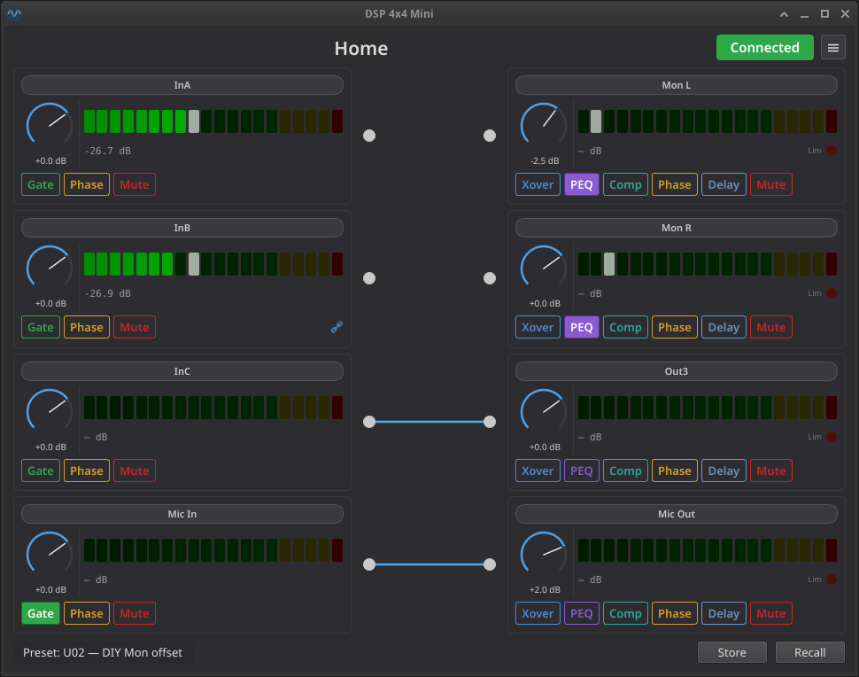
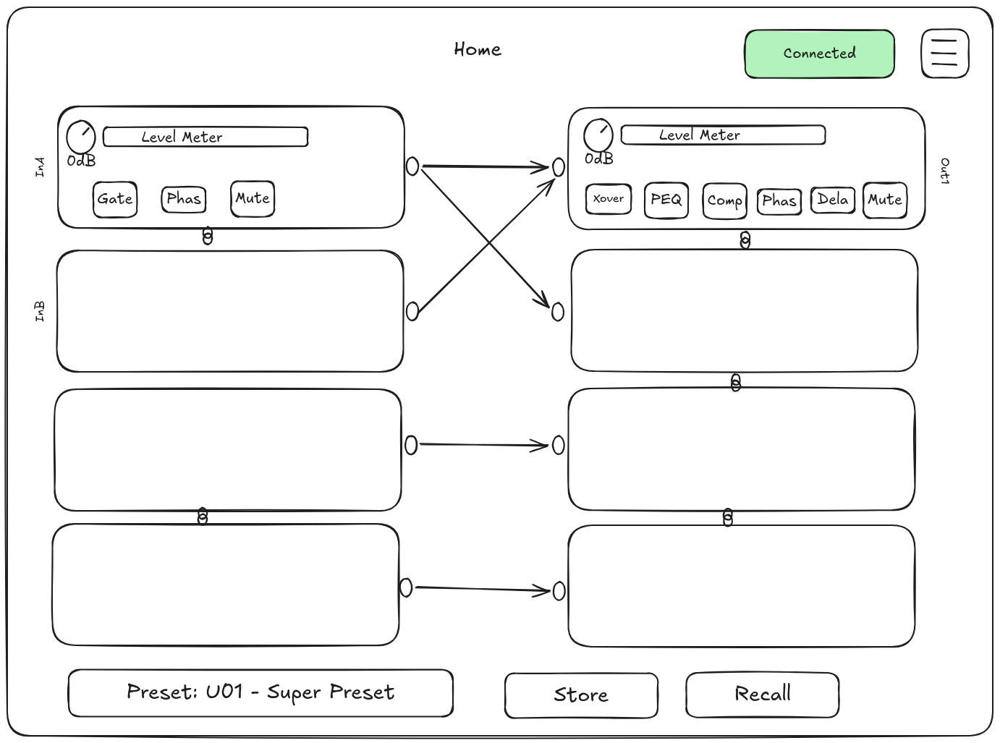
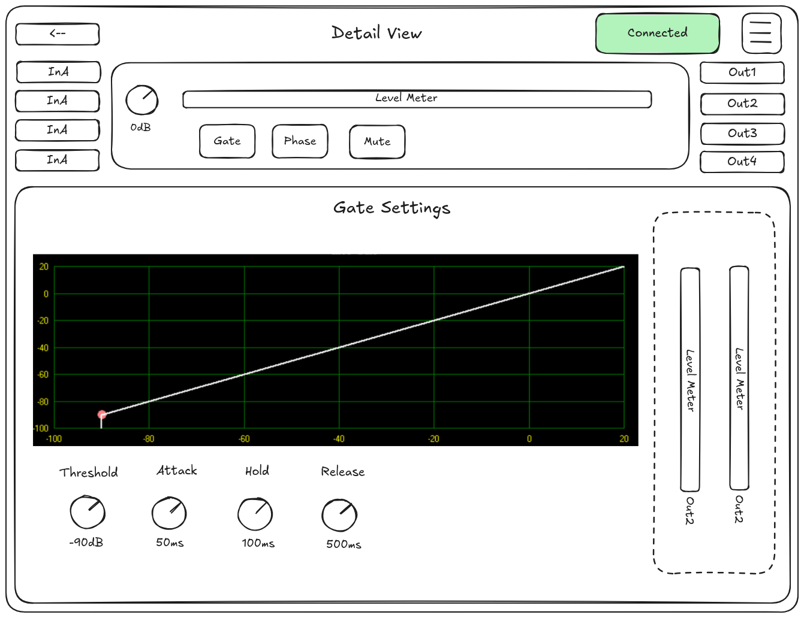
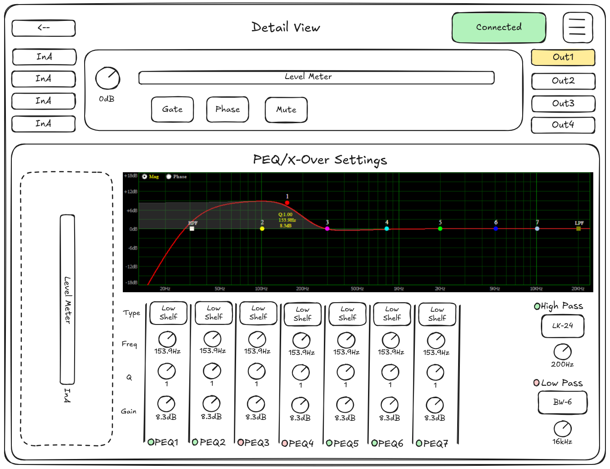

# miniDSP-Linux-qt

> **Status:** Work in progress — home view (8 channel strips, routing matrix, level meters), preset management, and the channel detail view with the **Gate** panel for inputs are functional. Crossover, PEQ, compressor, and delay panels are not yet implemented (the detail view shows a placeholder for them).

Qt graphical interface for the **the t.racks DSP 4x4 Mini**, built on top of the [miniDSP-Linux](https://github.com/IMBArator/miniDSP-Linux) protocol library. Provides full preset management, real-time metering, and an offline mode for editing without hardware connected.

## Home View



## UI concepts







## Features

### Home view

- Per-channel **gain knobs** (−60 to +12 dB) for 4 inputs and 4 outputs
- **Mute** and **phase invert** toggles per channel
- **Routing matrix** — interactive 4×4 input-to-output mapping (drag to connect, double-click to disconnect)
- **dB-scaled level meters** for all 8 channels
- **Outlined toggle buttons** — each feature button (gate / mute / phase / xover / peq / comp / delay) paints its accent color on the border and text when off, and fills with the same accent when on
- Startup **config read** — knobs and toggles reflect device state on connect
- **Auto-reconnect** on USB disconnect

### Channel detail view

Click the **Gate** button on any input strip to open the per-channel detail view:

- Header with the same channel strip from the home view (gain knob, level meter, mute/phase/gate toggles, name)
- Quick navigation buttons for all 4 inputs and 4 outputs
- A feature panel area, currently:
  - **Gate** (inputs) — Threshold, Attack, Hold, Release knobs plus a live transfer-function graph; all four parameters are sent atomically (protocol command 0x3E)
  - A **placeholder panel** is shown when the active feature does not apply to the selected channel (e.g. Gate on an output)
- Routed-channel level meters — outputs to the right of an input, inputs to the left of an output, driven by the routing matrix

### Preset management

- **Recall** any of the 30 user presets (U01–U30) or the factory preset (F00)
- **Store** current settings to any user slot with a custom name
- Confirmation dialog before writing to device flash
- Preset name label updates in real time

### Offline mode (`--offline`)

- In-RAM virtual DSP — no hardware required
- Edit gains, mutes, phases, routing, PEQ, crossovers, compressors, delays
- **Load and save .unt files** — round-trip with the manufacturer file format
- Seed from a bundled `blank.unt` template

### .unt file support

- **Load** manufacturer .unt files — parses all 30 preset slots
- **Save** .unt files with byte-identical round-trip for untouched data
- Preserves unknown bytes when editing individual fields

## Requirements

- Python 3.11+
- [uv](https://docs.astral.sh/uv/) — manages the virtual environment and dependencies
- [miniDSP-Linux](https://github.com/IMBArator/miniDSP-Linux) — protocol library (installed from local wheel)
- Linux with kernel HID driver — communicates via `/dev/hidraw*`
- Read/write access to `/dev/hidraw*` (see [Permissions](#permissions))

## Installation

```bash
git clone https://github.com/IMBArator/miniDSP-Linux-qt.git
cd miniDSP-Linux-qt
uv sync              # creates .venv, installs dependencies
uv sync --extra dev  # also installs pytest for development
```

## Usage

### Connected mode

```bash
minidspqt              # connect to hardware (WARNING level)
minidspqt -v           # info-level logging (recall tracing, config reads)
minidspqt -vv          # debug-level logging (USB frame traces)
```

### Offline mode

```bash
minidspqt --offline    # virtual DSP, no hardware needed
```

### .unt files

Use the menu button (top-right) to load or save `.unt` preset files. In offline mode, all 30 slots are editable and can be saved back to disk.

## Permissions

The tool communicates via `/dev/hidraw*`. By default this requires root. To allow regular users, create a udev rule:

```bash
sudo tee /etc/udev/rules.d/99-dspmini.rules << 'EOF'
SUBSYSTEM=="hidraw", ATTRS{idVendor}=="0168", ATTRS{idProduct}=="0821", MODE="0666"
EOF
sudo udevadm control --reload-rules && sudo udevadm trigger
```

Then reconnect the device.

## Running tests

```bash
uv run --with pytest --with pytest-qt pytest tests/ -v
```

62 tests covering the device thread, model, virtual DSP, preset picker, routing matrix, and .unt read/write round-trip.

## Repository structure

```
minidspqt/                     Main package
  cli.py                       Entry point: -v/--offline flags
  app.py                       QApplication setup, dark theme, offline seeding
  model.py                     Typed device state (DeviceState dataclass)
  device_thread.py             QThread: poll loop, command coalescing, preset queue
  virtual_dsp.py               In-RAM DSP implementing DSPmini interface
  unt_loader.py                Parse .unt files (single-slot and all-slots)
  unt_writer.py                Write .unt files with field-level overwrites
  views/
    main_window.py             Main window: owns thread, state, Recall/Store
    home_view.py               8 channel strips + routing matrix + level meters
    preset_picker.py           Recall/Store preset dialog (F00 + 30 user slots)
    channel_strip.py           ChannelStrip + InputChannelStrip / OutputChannelStrip
    detail_view.py             Per-channel detail view with feature panels and routed meters
    panels/
      gate_panel.py            Gate parameters (threshold, attack, hold, release) + transfer graph
      placeholder_panel.py     Shown when the active feature is N/A for the selected channel
  widgets/                     Custom Qt widgets (GainKnob, GateGraph, LedIndicator, LevelMeter, ParamKnob, RoutingMatrix, ToggleButton)
  resources/                   blank.unt template, icons, style.qss

tests/                         pytest suite (62 tests)
  conftest.py                  FakeDSPmini test fixture (extends VirtualDSP)
  test_device_thread.py        Command coalescing and queue behaviour
  test_model.py                DeviceState.from_config parsing
  test_virtual_dsp.py          State persistence, load/store round-trip
  test_preset_picker.py        Dialog behaviour (disabled slots, F00, store)
  test_routing_matrix.py       Drag-to-connect, double-click-disconnect, hit detection
  test_unt_loader.py           .unt parsing and validation
  test_unt_writer.py           Byte-identical round-trip, field-level edits

doc/
  concept-art/                 UI mockups (.excalidraw + .png)
  user-guide.md                End-user documentation
  architecture-plan.md         Original architecture plan (historical)
  offline-mode-unt-read-write.md  Implementation plan
```

## Roadmap

> Comparison against the [miniDSP-Linux](https://github.com/IMBArator/miniDSP-Linux) protocol library.

### Done

| Feature | Library API | Notes |
|---------|------------|-------|
| Gain control (8 ch) | `set_gain` | Knob, linked-channel sync |
| Mute (8 ch) | `mute` | Per-channel toggle |
| Phase invert (8 ch) | `set_phase` | Per-channel toggle |
| Level meters (8 ch) | `poll_levels` | 150 ms poll, dB-scaled, peak-hold |
| Channel names | `set_channel_name` | Click-to-edit, max 8 chars |
| Preset recall | `load_preset` | F00 + U01–U30, slot names |
| Preset store | `store_preset` | Name entry, flash-write confirm |
| Config read | `read_config` | Full state on connect |
| Routing matrix | `set_matrix_route` | Interactive: drag-to-connect, double-click-to-disconnect |
| Auto-reconnect | — | 2 s retry on USB disconnect |
| Offline mode | — | VirtualDSP, no hardware |
| .unt load/save | — | 30-slot round-trip |
| Linked channel display | `decode_link_groups` | Icon + disabled controls on slaves |
| Limiter indicator | `limiter_mask` in `poll_levels` | Red LED + "Lim" label on output strips, bitmask-driven |
| Channel detail view (Gate) | `set_gate` | Per-channel canvas with quick-nav, routed meters, and a Gate panel for input channels (threshold / attack / hold / release + transfer-function graph). Outputs and other features show a placeholder |

### High priority

| Feature | Library API | What's missing |
|---------|------------|----------------|
| **Detail view: Crossover / PEQ / Compressor / Delay panels** | `set_hipass`, `set_lopass`, `set_peq_band`, `set_compressor`, `set_delay` | Output-channel feature panels. Detail-view scaffolding (navigation, routed meters, placeholder fallback, MainWindow wiring) is already in place; backend fully exists in DeviceThread, VirtualDSP, and model |
| **PEQ channel bypass** | `set_peq_channel_bypass` | Toggle + per-band bypass checkboxes in PEQ view |

### Medium priority

| Feature | Library API | What's missing |
|---------|------------|----------------|
| **Channel linking UI** | `prepare_link` + `set_channel_link` | Context menu or link button; `request_prepare_link()` missing from DeviceThread |
| **Test tone generator** | `set_test_tone` | Dialog: Off / Pink / White / Sine + 31-step freq picker |
| **EQ curve visualisation** | — | QPainter frequency-response graph from PEQ params |

### Low priority

| Feature | Library API | What's missing |
|---------|------------|----------------|
| Delay display unit (ms/m/ft) | `set_delay_unit` | Dropdown in delay view |
| Firmware string display | `cmd_firmware` response | Surface in About dialog |
| Device lock / PIN | `is_locked`, `submit_pin`, `set_lock_pin` | PIN entry dialog; dangerous feature |
| Copy channel settings | — | "Copy from…" context menu |
| PEQ reset button | — | "Reset EQ" sends 7× flat bands |
| Show-all-EQ overlay | — | Checkbox to overlay 4 output curves |

## Related projects

- [miniDSP-Linux](https://github.com/IMBArator/miniDSP-Linux) — Protocol library and CLI tool this project depends on
- [dsp-408-ui](https://github.com/Aeternitaas/dsp-408-ui) — Same Musicrown protocol over TCP for the DSP 408

## Acknowledgments

- [PySide6](https://wiki.qt.io/Qt_for_Python) — GUI framework (Qt for Python, licensed under LGPLv3/GPLv3)
- [miniDSP-Linux](https://github.com/IMBArator/miniDSP-Linux) — Protocol library and CLI tool this project depends on

This application uses the PySide6 Qt binding. PySide6 is licensed under the
[GNU Lesser General Public License v3](https://www.gnu.org/licenses/lgpl-3.0.en.html).
Users have the right to obtain, modify, and redistribute the Qt/PySide6 library
source code. The library is dynamically linked; users can replace the PySide6
version at runtime without modifying this application.

## License

This project is licensed under the [GNU General Public License v3.0](LICENSE).

Not affiliated with Musicrown, the t.racks, or Thomann. Protocol reverse-engineered for interoperability purposes under applicable law.
