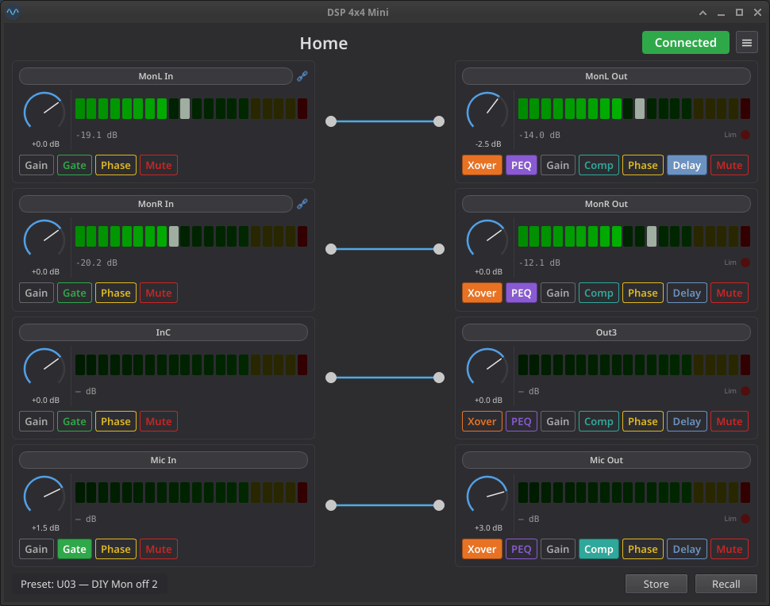

# miniDSP-Linux-qt

> **Status:** Work in progress — see [Features](#features) for completed features

> 📖 **New here?** Read the [**User Guide**](docs/user-guide.md) — a full walkthrough of every panel, dialog, and workflow.

> 🛠 **Contributing or building from source?** See the [**Development Guide**](docs/development.md).

A full-featured Qt graphical interface for the **t.racks DSP 4x4 Mini** audio processor, built on top of the [miniDSP-Linux](https://github.com/IMBArator/miniDSP-Linux) protocol library. Covers the complete DSP signal chain — gain, routing, noise gate, parametric EQ, crossover, compressor, delay — plus preset management, channel linking, a test tone generator, device lock / PIN, light/dark theming, and an offline mode for editing without hardware.

## Home View



See [UI Concepts](docs/concepts.md) for original design mockups.

## Installation

### AppImage (recommended)

Download the latest `minidspqt-<version>-x86_64.AppImage` from the [Releases page](https://github.com/IMBArator/miniDSP-Linux-qt/releases) — a single executable that bundles its own CPython and PySide6 (no Python or virtualenv needed on your machine):

```bash
chmod +x minidspqt-*-x86_64.AppImage
./minidspqt-*-x86_64.AppImage              # connected mode
./minidspqt-*-x86_64.AppImage --offline    # virtual DSP, no hardware
```

### pip (release wheel)

Prefer a normal Python install? Grab the wheel from the same [Releases page](https://github.com/IMBArator/miniDSP-Linux-qt/releases) and install it into a virtual environment (requires Python 3.11+):

```bash
python3 -m venv .venv
source .venv/bin/activate
pip install "https://github.com/IMBArator/miniDSP-Linux-qt/releases/download/vX.Y.Z/minidsp_linux_qt-X.Y.Z-py3-none-any.whl"
minidspqt            # or: minidspqt --offline
```

Both install paths talk to the device over `/dev/hidraw*`, so non-root use needs the udev rule under [Permissions](#permissions).

## Usage

### Connected mode

```bash
minidspqt              # connect to hardware (WARNING level)
minidspqt -v           # info-level logging (recall tracing, config reads)
minidspqt -vv          # debug-level logging (USB frame traces)
```

### Offline mode

```bash
minidspqt --offline    # virtual DSP, no hardware needed
```

### .unt files

Use the menu button (top-right) to load or save `.unt` preset files. In offline mode, all 30 slots are editable and can be saved back to disk.

## Permissions

The tool communicates via `/dev/hidraw*`. By default this requires root. To allow regular users, create a udev rule:

```bash
sudo tee /etc/udev/rules.d/99-dspmini.rules << 'EOF'
SUBSYSTEM=="hidraw", ATTRS{idVendor}=="0168", ATTRS{idProduct}=="0821", MODE="0666"
EOF
sudo udevadm control --reload-rules && sudo udevadm trigger
```

Then reconnect the device.

## Features

### Home view

- Per-channel **gain knobs** (−60 to +12 dB) for 4 inputs and 4 outputs (`cmd_gain`)
- **Mute** and **phase invert** toggles per channel (`cmd_mute`, `cmd_phase`)
- **Routing matrix** — interactive 4×4 input-to-output mapping (drag to connect, double-click to disconnect) (`cmd_matrix_route`)
- **dB-scaled level meters** for all 8 channels (`cmd_poll`, `parse_levels`)
- **Outlined toggle buttons** — each feature button (gate / mute / phase / xover / peq / comp / delay) paints its accent color on the border and text when off, and fills with the same accent when on
- Startup **config read** — knobs and toggles reflect device state on connect (`cmd_read_config`, `parse_config_page`)
- **Auto-reconnect** on USB disconnect
- **Channel names** — click any channel label to rename (max 8 characters), sent to the device immediately (`cmd_set_channel_name`)
- **Limiter indicator** — red LED on output strips lights up when the compressor is actively limiting (`parse_levels` response field)

### Light / dark theme

- Follows the **system color scheme** automatically (Qt 6.5+ `QStyleHints.colorSchemeChanged`); switches live when the OS appearance changes
- Manual override via **Menu → Theme** (System / Light / Dark), persisted across sessions via `QSettings`
- Custom-painted widgets (PEQ / crossover / gate graphs, level meter, knobs, routing matrix, limiter LED) are theme-aware: graph backgrounds use a soft tinted off-white in light mode rather than pure white

### Channel linking

- **Linked channel display** — master and slave strips show a chain icon; slave controls are disabled with a tooltip indicating the master (`decode_link_groups`)
- Editable from **Menu → Channel linking…** — a popup with two triangular radio-button matrices (inputs / outputs) where each row picks the channel it is linked to (or its own diagonal for *standalone*) (`cmd_prepare_link`, `cmd_channel_link`)
- The lowest-indexed channel in each group automatically becomes the master, matching the device's master = OR-bitmask / slave = 0x00 wire convention
- Forbidden configurations are greyed out: a slave can't itself be picked as a target (no chains), and a master with active slaves can't be demoted before they are released
- Headers, row labels, and the live "InA: master of …" / "InB: linked to InA" status text use the user's custom channel names from the home view
- Apply sends `OP_PREPARE_LINK` (0x2A) for every new pair followed by `OP_LINK` (0x3B) for each affected channel, then re-reads the device config so the dialog reflects whatever the device actually committed; offline mode uses the same code path against the in-memory virtual DSP

### Copy channel settings

- Accessible from **Menu → Copy channel settings…**
- Select a source channel from all 8 channels (InA–InD, Out1–Out4)
- Choose which parameter groups to copy (Name, Gain, Mute, Phase, Gate for inputs; plus Routing, Crossover, PEQ, Compressor, Delay for outputs)
- Target channels update automatically to the same type as the source; exclude the source itself
- Linked slave targets are restricted to Name-only with a warning banner
- Parameters are sent as raw protocol values and a config reload refreshes the UI

### Channel detail view

Click the **Gate** button on any input strip — or the **PEQ** / **Xover** / **Comp** button on any output strip — to open the per-channel detail view:

- Header with the same channel strip from the home view (gain knob, level meter, mute/phase/gate or mute/phase/peq/… toggles, name)
- Quick navigation buttons for all 4 inputs and 4 outputs; the active feature is preserved across channel switches when valid for the new channel type
- A feature panel area:
  - **Gate** (inputs) — Threshold, Attack, Hold, Release knobs plus a live transfer-function graph; all four parameters are sent atomically (`cmd_gate`)
  - **PEQ** (outputs) — 7 bands of (Type / Freq / Gain / Q / Bypass) below a summed frequency-response graph, plus a channel-bypass toggle in the panel header. Per-band atomic emit. Each band's numbered marker on the graph is **interactive** — drag horizontally to set frequency and vertically to set gain (gain only for Peak/Shelf types; Pass/Allpass markers move in frequency only), scroll the mouse wheel over a marker to adjust its Q (Ctrl for coarse steps), and double-click a marker to bypass or re-enable that band. Shelves and pass filters cap Q at 3.0 to match the official editor; Peak and the two allpass forms keep the full Q range (`cmd_peq_band`, `cmd_peq_channel_bypass`)
  - **Crossover** (outputs) — Hi-Pass and Lo-Pass rows, each with frequency knob, slope selector (BW 6 / BL 6 / BW 12 / BL 12 / LR 12 / BW 18 / BL 18 / BW 24 / BL 24 / LR 24), and bypass toggle. Bypass is independent of the slope selector (matching the manufacturer software). Both the Xover and PEQ panels share a combined frequency-response graph that shows the summed crossover + PEQ curve; the HP/LP **triangle markers are interactive** — drag horizontally to set cutoff frequency, scroll the mouse wheel over a marker to step the slope one position, and double-click to toggle that filter's bypass (works on dim/bypassed markers too so they can be re-enabled) (`cmd_hipass`, `cmd_lopass`)
  - **Compressor** (outputs) — Threshold (−90 to +20 dB) and Knee (0 – 12 dB) knobs, a Ratio combo (16 named ratios from 1:1.0 to Limit), and Attack (1–999 ms) / Release (10–3000 ms) knobs. All five parameters are sent atomically and visualised on a live input-vs-output transfer-function graph that renders the soft/hard knee elbow and the Limit clamp (`cmd_compressor`)
  - **Delay** (outputs) — Single edit knob (0 – 680 ms, 3-decimal ms display, typed input accepts `"12.5 ms"` or `"601 sa"`) targeting the displayed output, plus an overview bar graph showing every output's delay on a shared auto-scaling axis (snaps to the next 20 ms above the largest active delay; clamps at 680 ms). The graph re-targets to whichever output the strip nav buttons select, so a single panel covers all four outputs without per-channel duplication (`cmd_delay`)
  - A **placeholder panel** is shown when the active feature does not apply to the selected channel (e.g. Gate on an output)
  - A **Reset** button in the header of every feature panel (Gate / PEQ / Crossover / Compressor / Delay) snaps just that feature on the displayed channel — plus any linked slaves — back to the F00 factory defaults after a confirmation dialog (`load_factory_defaults`)
- Routed-channel level meters — outputs to the right of an input, inputs to the left of an output, driven by the routing matrix
- Strip-level "active" indicators: the input Gate button fills green when the gate threshold is above the noise floor; the output PEQ button fills purple when at least one band has non-zero gain and is not bypassed; the output Xover button fills amber when either hi-pass or lo-pass is not bypassed; the output Comp button fills teal when the ratio is anything other than 1:1.0; the output Delay button fills light blue when the delay is non-zero
- Master → slave parameter fan-out: editing any compressor / delay (or gate / PEQ / crossover) parameter on a master channel mirrors the change to every linked slave in both the on-screen model and the device requests (internal logic using `decode_link_groups`)
- **EQ curve visualisation** — QPainter log-frequency/dB graphs driven by local biquad coefficient math (Audio EQ Cookbook / RBJ), shared between PEQ and Crossover panels; crossover markers (triangles) and PEQ band markers (numbered circles) overlay the summed magnitude response. In the PEQ panel the numbered markers are draggable (set frequency / gain), the wheel adjusts Q, and double-click toggles bypass; in the Crossover panel the HP/LP triangles mirror the same gestures (drag = cutoff frequency, wheel = slope, double-click = bypass)
- **Overlay other outputs** — both the PEQ and Crossover panel headers carry a colour-coded checkbox per *other* output channel; tick one to overlay that output's full response (PEQ + crossover) on the graph for comparison. Each output keeps a stable colour, overlays track live edits, and the selection clears when you switch channels (works on linked-slave channels too)

### Preset management

- **Recall** any of the 30 user presets (U01–U30) or the factory preset (F00) (`cmd_load_preset`, `cmd_read_config`, `parse_preset_params`)
- **Store** current settings to any user slot with a custom name (`cmd_store_preset_name`, `cmd_store_preset`)
- Confirmation dialog before writing to device flash
- Preset name label updates in real time (`cmd_read_name`, `parse_preset_name`)

### Offline mode

- Enter at launch with `--offline`, or switch at runtime via **Menu → Connection mode → Offline**
- In-RAM virtual DSP — no hardware required
- Edit gains, mutes, phases, routing, PEQ, crossovers, compressors, delays
- **Load and save .unt files** — round-trip with the manufacturer file format
- Online → Offline carries the live device state into the virtual DSP so you keep editing what was on the device
- Offline → Online prompts before discarding offline edits (save your `.unt` first to keep them)
- Cold-launching offline (no live config seen yet) seeds from the bundled `blank.unt` template

### .unt file support

- **Load** manufacturer .unt files — parses all 30 preset slots
- **Save** .unt files with byte-identical round-trip for untouched data
- Preserves unknown bytes when editing individual fields

### Test tone generator

- Accessible from **Menu → Test tone…** — non-modal dialog with Off / Pink / White / Sine radios (`cmd_test_tone`)
- 31-step ISO 1/3-octave sine frequency selector (20 Hz – 20 kHz)
- Full-width red **Disable test tone** panic button for instant silence
- Generator keeps running after closing the dialog; state survives power cycles (`parse_preset_params` test tone fields)

### Device lock / PIN

- **Auto-prompt on connect** — when the device reports it is locked (`cmd_device_info` byte 6 = `0x01`) the worker pauses config load and pops a modal **Unlock device** dialog. Up to three PIN attempts; wrong PIN shows inline `N attempts remaining`; cancel or exhaustion disconnects without auto-reconnecting so the user is not stuck in an unlock-prompt loop (`cmd_submit_pin`)
- **Set a new PIN** from **Menu → Set device PIN…** with a confirm field; on ACK the application closes the USB session and stops the worker (set-PIN is a one-shot admin action, not a normal edit) (`cmd_set_lock_pin`)
- **Reconnect** menu entry re-arms the worker after any user-initiated disconnect (cancel, three wrong PINs, or set-PIN ACK)
- PINs are 4 raw bytes — any 4 printable ASCII characters work, not just digits, regardless of the upstream library docstring
- No "Remove PIN" action is exposed because the protocol has no such command; offline mode mirrors the same semantics against the in-memory virtual DSP for safe experimentation
- See [Device Lock / PIN in the user guide](docs/user-guide.md#device-lock--pin) for the full UX walkthrough and the **⚠ no known factory reset** warning

### About / device info

- **Menu → About** shows the application version plus, when a device is connected, its model and firmware version read from the `0x13` firmware query (`4x4MINI` / `V010`). Offline or before connecting, it shows the app version and a status line instead (`cmd_firmware`, `parse_firmware`)

### Knob interaction

- **Click and drag** vertically, **scroll wheel**, or **arrow keys** for ±1 raw unit steps
- **Ctrl + scroll / drag / arrows** for range-adaptive fast editing (~2 % of range per step)
- **Click the dB label** to type an exact value via keyboard
- **Double-click** on any knob to reset to its default value (emits `valueChanged` signal)

## Roadmap

> Comparison against the [miniDSP-Linux](https://github.com/IMBArator/miniDSP-Linux) protocol library. See [Features](#features) for completed functionality.

| Feature | Library API | What's missing |
|---------|-------------|----------------|
| Refactor linking indicator: right from header pill with text | — | — |
| Detail View: mark with underline the currently edited feature | — | — |
| Delay display unit (ms/m/ft) | `cmd_set_delay_unit` | Dropdown in delay view |

### Needed?

| Feature | Library API | What's missing |
|---------|-------------|----------------|
| PEQ extras | — | Copy-band / paste-band, A/B compare |

## Related projects

- [miniDSP-Linux](https://github.com/IMBArator/miniDSP-Linux) — Protocol library and CLI tool this project depends on
- [dsp-408-ui](https://github.com/Aeternitaas/dsp-408-ui) — Same Musicrown protocol over TCP for the DSP 408

## Acknowledgments

- [PySide6](https://wiki.qt.io/Qt_for_Python) — GUI framework (Qt for Python, licensed under LGPLv3/GPLv3)
- [miniDSP-Linux](https://github.com/IMBArator/miniDSP-Linux) — Protocol library and CLI tool this project depends on

This application uses the PySide6 Qt binding. PySide6 is licensed under the
[GNU Lesser General Public License v3](https://www.gnu.org/licenses/lgpl-3.0.en.html).
Users have the right to obtain, modify, and redistribute the Qt/PySide6 library
source code. The library is dynamically linked; users can replace the PySide6
version at runtime without modifying this application.

## License

This project is licensed under the [GNU General Public License v3.0](LICENSE).

Not affiliated with Musicrown, the t.racks, or Thomann. Protocol reverse-engineered for interoperability purposes under applicable law.
