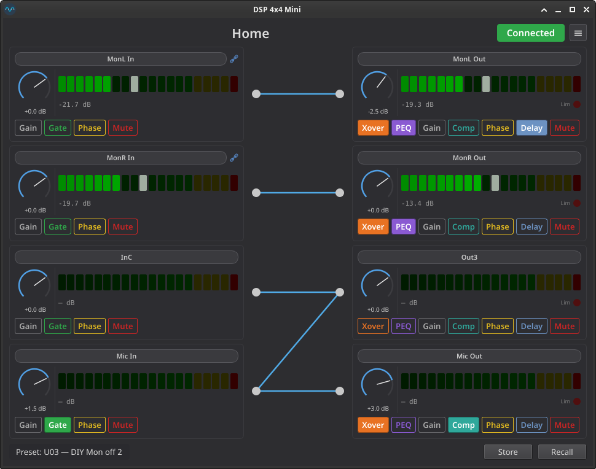
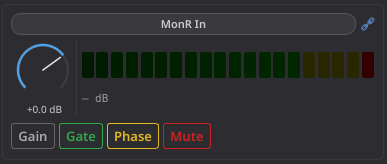
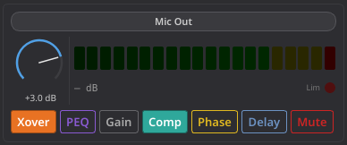
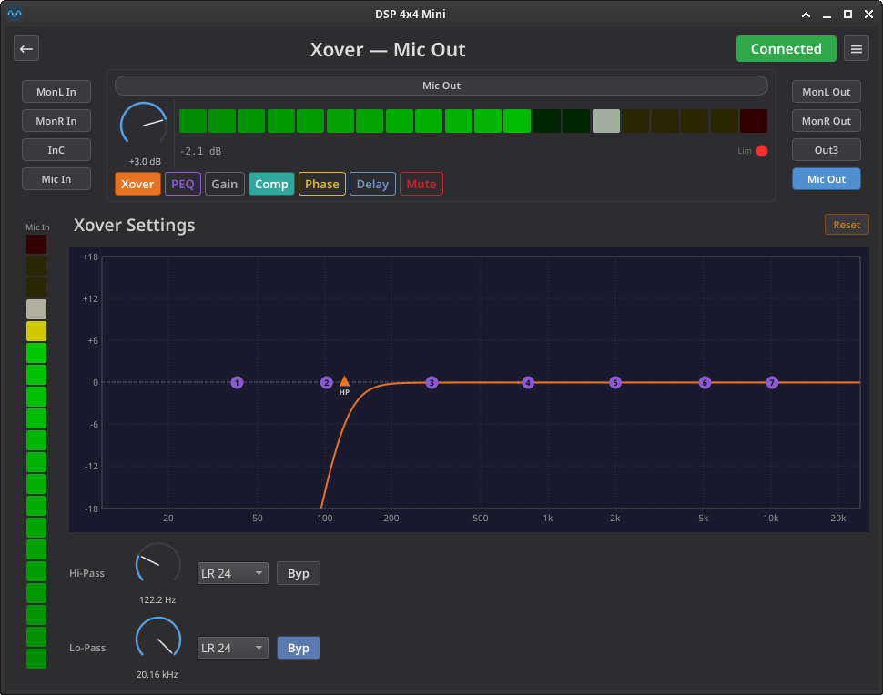
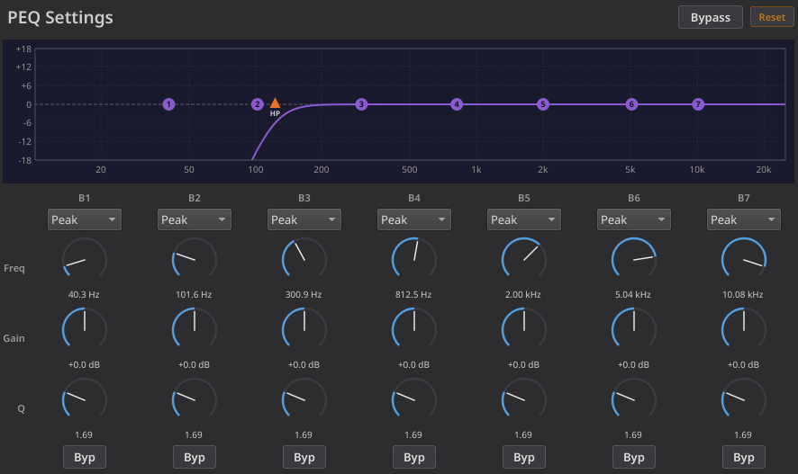
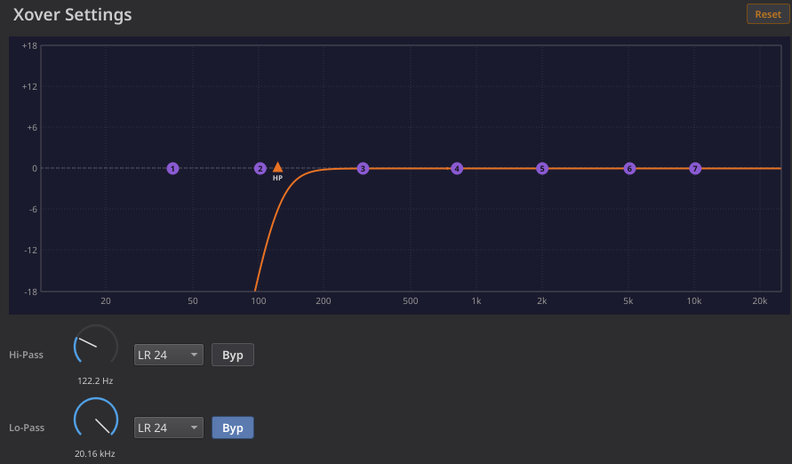
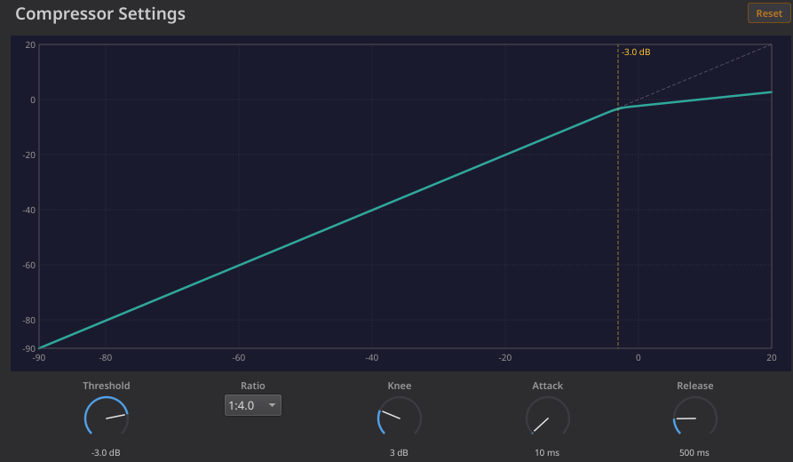
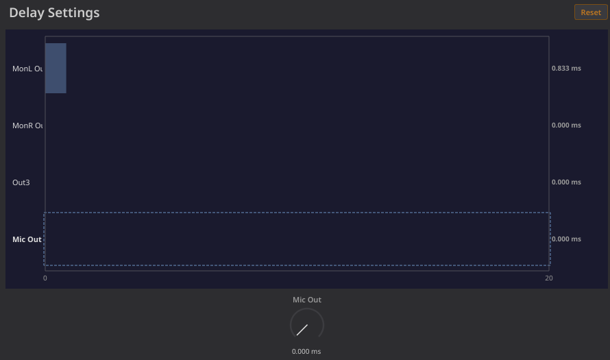
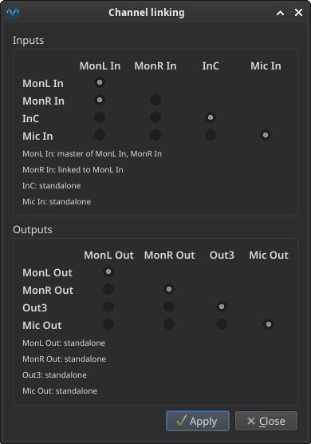
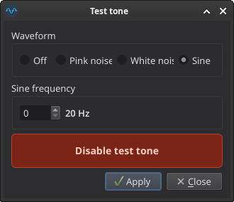

# DSP 4x4 Mini — User Guide

Qt graphical interface for the **t.racks DSP 4x4 Mini** audio processor.

## Installation

See the [**Installation**](../README.md#installation) section of the README for the two supported install methods — the prebuilt **AppImage** (recommended) or the **pip** release wheel. A t.racks DSP 4x4 Mini connected via USB is required, or use [offline mode](#offline-mode) to explore without hardware.

To run from source for development, see the [Development Guide](development.md).

---

## USB Permissions

The application talks to the DSP via `/dev/hidraw*`, which requires root by default. To use it as a regular user, add the udev rule documented in the [**Permissions**](../README.md#permissions) section of the README, then disconnect and reconnect the device.

---

## Starting the Application

```bash
minidspqt              # connect to hardware (default logging)
minidspqt -v           # info-level logging
minidspqt -vv          # debug-level logging (USB frame traces)
minidspqt --offline    # virtual DSP, no hardware needed
```

On launch the application attempts to open the DSP via `/dev/hidraw*`. If the device is found, it reads the full configuration (preset data, channel names, gain, routing, mute/phase state) and populates all controls. Level meters begin updating at ~150 ms intervals.

If no device is found, the UI shows **Disconnected** and all controls are disabled. The application will auto-retry every 2 seconds.

---

## Home View Layout

The main window is divided into three columns:



- **Left column** — 4 input channel strips (InA through InD)
- **Center** — interactive 4x4 routing matrix
- **Right column** — 4 output channel strips (Out1 through Out4)
- **Bottom bar** — current preset name, Recall and Store buttons

---

## Channel Strips

Each of the 8 channels (4 inputs, 4 outputs) has an identical strip layout:





### Gain Knob

The rotary dial controls channel gain from **-60 dB** to **+12 dB**. Internally this maps to raw values 0–400 with dual resolution: coarse steps (0.5 dB) below -20 dB and fine steps (0.1 dB) above.

| Action | Effect |
|--------|--------|
| **Click and drag** vertically | Adjust gain — drag up to increase, down to decrease |
| **Ctrl + click and drag** | Fast-adjust — each pixel of drag moves ~2 % of the knob's range instead of ±1 raw unit |
| **Scroll wheel** | Step gain by ±1 raw unit (0.1 dB) |
| **Ctrl + scroll wheel** | Step by a range-adaptive amount (~2 % of the total range, minimum 3 raw units). Useful for large-range knobs like Delay (0 – 680 ms) where normal scroll is too slow |
| **Arrow keys** (Up/Right, Down/Left) | Step gain by ±1 raw unit (0.1 dB) |
| **Ctrl + arrow keys** | Step by the same range-adaptive amount as Ctrl + scroll |
| **Click the dB label** | Enter an exact dB value via keyboard. Press Enter to apply. Accepts formats like `+3.5`, `-20`, `-inf` |
| **Double-click** on the knob | Reset to the default value (e.g., 0 dB for gain) |

The arc fills with blue as gain increases from minimum to maximum. The needle indicator shows the current position.

### Level Meter

Each channel has a horizontal LED-style level meter with 20 segments:

- **Green** (15 segments): -50 dB to 0 dB
- **Yellow** (4 segments): 0 dB to +15 dB
- **Red** (1 segment): clip indicator (+15 dB)

A white peak-hold marker tracks the highest recent level and decays slowly (~1.5 s half-life). The numeric readout below the meter shows the peak-held dB value with ~1 s hold before decay.

### Limiter Indicator (Outputs Only)

Output channel strips display a small red LED labeled **Lim** to the right of the dB readout. This indicator lights up when the compressor/limiter on that output channel is actively limiting the signal. The data comes from the device's `limiter_mask` bitmask in the level polling response (~150 ms update rate). The LED tracks the displayed channel in both the home view (all four output strips simultaneously) and the channel detail view's header strip.

| LED State | Meaning |
|-----------|---------|
| Dim (dark red) | Limiter inactive — signal is below the compressor threshold |
| Bright red | Limiter active — the compressor is attenuating the signal |

### Toggle Buttons

The toggle buttons are arranged in **DSP signal-chain order** — left to right matches the actual processing pipeline inside the device:

| Channel type | Signal chain (left → right) |
|---|---|
| **Input** | **Gain** → Gate → Phase → Mute |
| **Output** | Xover → PEQ → **Gain** → Comp → Phase → Delay → Mute |

#### Gain indicator

The **Gain** button is a *position marker*, not a toggle — it shows where the gain knob sits in the signal chain. It has a distinct muted style (solid border, no fill) so you can tell it apart from the real toggles at a glance. Clicking it briefly flashes the gain knob's arc so you can quickly locate the control.

#### Feature toggles

The remaining buttons are color-coded per feature:

| Button | Accent color | Input | Output |
|--------|--------------|-------|--------|
| **Gate** | Green | Yes | — |
| **Phase** | Gold | Yes | Yes |
| **Mute** | Red | Yes | Yes |
| **Xover** | Amber | — | Yes |
| **PEQ** | Purple | — | Yes |
| **Comp** | Teal | — | Yes |
| **Delay** | Light blue | — | Yes |

Click a button to toggle the feature on/off. When **off** the button paints its accent color on the **border and text** (outlined look). When **on** the button fills with the same accent.

Two of the buttons act as **navigation buttons** rather than stateful toggles — they open the [channel detail view](#channel-detail-view) and immediately un-check themselves:

- **Gate** (input strips) opens the Gate panel. The button fills green whenever the gate is "armed" (threshold above the noise floor), regardless of whether the detail view is open.
- **PEQ** (output strips) opens the PEQ panel. The button fills purple whenever any band has non-zero gain and is not bypassed (and channel-bypass is off).
- **Xover** (output strips) opens the Crossover panel. The button fills amber whenever either the hi-pass or lo-pass filter is not bypassed.
- **Comp** (output strips) opens the Compressor panel. The button fills teal whenever the compressor's ratio is anything other than 1:1.0.
- **Delay** (output strips) opens the Delay panel. The button fills light blue whenever the output's delay is non-zero.

### Channel Names

Click the channel name button at the top of any strip to rename it. A dialog appears where you can type a new name (up to 8 characters). Press OK to apply — the name is immediately sent to the device.

### Linked Channels

When channels are linked on the device (e.g., stereo pair), both the **master** and **slave** channels display a chain icon (🔗) in the title row:

- **Master** — tooltip reads *"Master of Out1, Out2"*
- **Slave** — controls (gain knob and toggles) are disabled; tooltip reads *"Linked to Out1"*

Adjusting the master channel automatically updates all linked slaves.

To **edit** which channels are linked, open **Menu ≡ → Channel linking…** (see [Channel Linking](#channel-linking)).

---

## Channel Detail View

Click the **Gate** button on an input strip — or the **PEQ** / **Xover** / **Comp** / **Delay** button on an output strip — in the home view to open the channel detail view:



Layout:

- **Header** — back arrow, title (`<feature> — <channel name>`), connection badge, menu
- **Channel navigation** — buttons for all 4 inputs (left) and 4 outputs (right). Switching channels updates the strip and the feature panel without leaving the detail view. The active feature is preserved across channel switches when valid for the new channel type (e.g. moving Out1 → Out2 keeps you on the PEQ panel; moving Out1 → InA falls back to Gate)
- **Channel strip** — same widget as on the home view, kept synchronised with all gain / mute / phase / name edits
- **Routed meters** — when an input is selected, vertical meters for every output it routes to appear on the right; when an output is selected, meters for every input feeding it appear on the left
- **Feature panel** — the **Gate** panel for input channels, the **PEQ**, **Crossover**, **Compressor**, or **Delay** panel for output channels, or a **placeholder** ("This feature is not available for this channel") when the active feature doesn't apply to the selected channel type

Press **←** in the header to return to the home view.

### Gate Panel

The Gate panel exposes the four parameters of the per-input noise gate. All four are sent to the device atomically every time any one of them changes (the firmware command for the gate is monolithic).

| Knob | Range | Notes |
|------|-------|-------|
| **Threshold** | -89.5 dB to 0 dB | Click the value below the knob to type an exact dB value |
| **Attack** | 1 ms to 999 ms | Time constant for the gate opening |
| **Hold** | 10 ms to 999 ms | Time the gate stays open after the signal drops below threshold |
| **Release** | 1 ms to 3000 ms | Time constant for the gate closing |

The transfer-function graph next to the knobs shows input level (x-axis) versus output level (y-axis), with the threshold marker as a vertical dashed line. Below the threshold the gate is closed (signal cut to the noise floor); above it the gate passes the signal at unity gain. Only the threshold parameter affects the static graph — attack, hold, and release are time-domain parameters with no static representation.

The gate icon on the input channel strip shows green ("armed") whenever the threshold is above the very lowest setting, regardless of whether the detail view is open.

### PEQ Panel

The PEQ panel exposes the 7-band parametric EQ that lives on each output channel. The layout mirrors the t.racks editor: a frequency-response graph at the top showing the summed magnitude across all bands, then 7 columns of per-band controls below.



#### Per-band controls

| Control | Range | Notes |
|---------|-------|-------|
| **Type** | 7 filter types | Peak, Low Shelf, High Shelf, Low Pass, High Pass, AP1 (1st-order allpass), AP2 (2nd-order allpass) |
| **Freq** | 19.7 Hz – 20.16 kHz | Log-scaled raw 0–300; sub-1 kHz values shown with one decimal (e.g. `300.8 Hz`) to match the original editor; ≥ 1 kHz shown as kHz with two decimals (`5.00 kHz`) |
| **Gain** | −12.0 dB to +12.0 dB | 0.1 dB step; affects Peak / Low Shelf / High Shelf only — for pass and allpass filters the gain knob has no effect on the response |
| **Q** | 0.40 – 128 | Logarithmic scale; **shelves and pass filters are capped at Q = 3.0** (raw 35) per the official editor — switching the type combo to a shelf or pass automatically clamps Q if it was higher; switching back to Peak does *not* restore the previous higher Q |
| **Byp** | toggle | Bypasses *that* band only — the other 6 keep working |

Each control fires the band's parameters atomically: changing any one of the five widgets sends the full band over USB (protocol command `0x33`). All seven bands coalesce independently in the device thread, so dragging Q on band 3 doesn't compete with edits to band 1.

#### Channel-wide bypass

The **Bypass** toggle in the panel header bypasses the entire PEQ block for this output (protocol command `0x3C`). Per-band edits remain editable while bypass is engaged — flip it off and your settings come back exactly as they were.

#### Frequency-response graph

The graph plots the summed magnitude response of all seven bands at 256 log-spaced frequencies between 10 Hz and 25 kHz. Coefficients are computed locally from the raw protocol values using the Audio EQ Cookbook (RBJ) biquad formulas, evaluated at the device's 48 kHz internal sample rate so the displayed curve matches what the hardware actually produces.

- **Markers** — small numbered circles at each band's centre frequency (`1`..`7`). Active bands are green; band-bypassed or channel-bypassed bands are dim grey.
- **Channel-bypass visualisation** — when the channel-wide bypass is engaged the curve renders as a flat 0 dB line at reduced opacity, while the per-band controls remain editable.

**Direct manipulation on the graph** — the numbered markers are interactive, and every gesture updates the controls below, the curve, and the device live (exactly like a knob edit):

- **Drag** — grab an active band's marker: horizontal movement sets **frequency**, vertical movement sets **gain** (gain only for Peak / Low Shelf / High Shelf — Pass and Allpass markers stay pinned at 0 dB and move in frequency only).
- **Scroll wheel over a marker** — adjusts that band's **Q** (scroll up for higher Q / narrower; hold **Ctrl** for coarser steps). Q is clamped to the type's allowed range, so shelves and pass filters still cap at 3.0.
- **Double-click a marker** — toggles that band's **bypass**. This works on dim (already-bypassed) markers too, so a double-click re-enables them.

Drag and wheel act on **active** markers only; double-click works on any marker. Slave (linked) channels and channel-wide bypass leave the graph read-only.

#### "PEQ active" indicator on the output strip

The PEQ button on the output channel strip lights up purple whenever the channel's PEQ is shaping the signal, defined as: **at least one band has gain ≠ 0 dB AND is not bypassed AND the channel-wide bypass is off**. The state updates live as you drag knobs and toggle bypasses, on both the home view and the detail view's strip header.

### Crossover Panel

The Crossover panel exposes the hi-pass and lo-pass filters on each output channel. Each filter has three controls:



#### Per-filter controls

| Control | Range | Notes |
|---------|-------|-------|
| **Frequency knob** | 19.7 Hz – 20.16 kHz | Log-scaled, same encoding as PEQ frequency |
| **Slope selector** | 9 slope types | BW 6, BL 6, BW 12, BL 12, LR 12, BW 18, BL 18, BW 24, BL 24, LR 24 |
| **Bypass toggle** | On/Off | Bypasses that filter independently. When bypassed, the slope selector still shows the last-used slope (or LR-24 by default), so un-bypassing re-activates with the correct setting |

> **Important:** The device **forgets** the slope value when a filter is bypassed. The application tracks the last-active slope and re-sends it when you un-bypass. If the application is restarted while a filter is bypassed, the slope defaults to **LR-24** (the device default).

#### Shared frequency-response graph

Both the **Crossover** and **PEQ** panels share a combined frequency-response graph that shows the **summed crossover + PEQ magnitude response**. Editing a crossover filter updates the graph on both panels, and vice versa. The graph uses local biquad coefficient math (Audio EQ Cookbook / RBJ) for both the crossover filters (cascaded 2nd-order Butterworth / Bessel / Linkwitz-Riley sections) and the PEQ bands.

- **PEQ band markers** — numbered circles (`1`..`7`) at each band's centre frequency
- **Crossover markers** — blue triangles labeled `HP` / `LP` at the respective cutoff frequencies. A bypassed filter's triangle dims to grey but stays visible at its last cutoff so you can see and re-grab it.

**Direct manipulation on the graph** — the HP / LP triangles are interactive, and every gesture updates the controls below, the curve, and the device live (exactly like a knob edit):

- **Drag** — grab an active marker and move it horizontally to set that filter's **cutoff frequency** (vertical movement is ignored; the markers always sit at 0 dB).
- **Scroll wheel over a marker** — steps the filter's **slope** one position up or down through the slope list (BW 6 → BL 6 → … → LR 24).
- **Double-click a marker** — toggles that filter's **bypass**. This works on dim (already-bypassed) markers too, so a double-click re-enables them at their previous slope.

Drag and wheel act on **active** markers only; double-click works on any marker (active or dim). Slave (linked) channels leave the graph read-only.

#### "Xover active" indicator on the output strip

The Xover button on the output channel strip lights up amber whenever **either** the hi-pass or lo-pass filter is not bypassed (i.e., has a non-zero slope). The state updates live when you toggle bypass or change the slope selector.

### Compressor Panel

The Compressor panel exposes the per-output dynamics processor. The hardware sends all five compressor parameters in a single atomic frame (protocol command `0x30`), so a change to any one knob re-emits the full block — there is no per-parameter coalescing for the compressor.



#### Controls

| Control | Range | Notes |
|---------|-------|-------|
| **Threshold** | −90.0 dB to +20.0 dB | 0.5 dB step. Click the value below the knob to type an exact dB value |
| **Ratio** | 16 named ratios | `1:1.0` (no compression), `1:1.1`, `1:1.3`, `1:1.5`, `1:1.7`, `1:2.0`, `1:2.5`, `1:3.0`, `1:3.5`, `1:4.0`, `1:5.0`, `1:6.0`, `1:8.0`, `1:10.0`, `1:20.0`, `Limit` (hard limiter; clamps output at the threshold). Selected via a drop-down combo for parity with the PEQ / Crossover type selectors |
| **Knee** | 0 – 12 dB | 0 = hard knee (instant break at threshold); higher values smooth the elbow symmetrically around the threshold |
| **Attack** | 1 – 999 ms | Time constant for engaging compression once the input exceeds the threshold |
| **Release** | 10 – 3000 ms | Time constant for releasing compression after the input falls back below the threshold |

#### Transfer-function graph

The graph plots **input level (dB) → output level (dB)** over the full −90..+20 dB range with grid lines and labels every 20 dB. Three reference layers are drawn:

- **Dashed 45° diagonal** — the no-compression baseline; the curve sits on this line for inputs below the threshold minus half the knee width
- **Solid curve** — the compressor's static transfer function, computed locally from the current threshold / ratio / knee values. Above the threshold + half-knee the slope is `1/ratio`; inside the knee window the elbow is smoothed quadratically. `Limit` flattens the curve to a horizontal line at the threshold
- **Vertical dashed marker** — the current threshold, labelled with the dB value

Attack and release are time-domain parameters and have no effect on the static curve — only threshold, ratio, and knee reshape the graph.

#### "Compressor active" indicator on the output strip

The Comp button on the output channel strip lights up teal whenever the ratio is anything other than **1:1.0** (i.e., the device is at least nominally compressing). The indicator hue matches the button's brand colour — only the fill changes, never the colour.

#### Linked-channel sync

The hardware copies a master channel's compressor settings to its slaves internally but emits no telemetry for that copy. The application mirrors the master-to-slave fan-out on every live edit: a change to the master's Threshold / Ratio / Knee / Attack / Release re-emits the full block to every linked slave, both in the on-screen model and on the wire. When the detail view shows a slave channel, the Compressor panel locks (all five controls disabled) and a `🔗 Linked to <master> — read-only` banner appears above the panel.

### Delay Panel

The Delay panel exposes the per-output digital delay (0 – 680 ms, stored on the device as 0 – 32 640 samples @ 48 kHz, protocol command `0x38`).

Each output only has a single delay parameter, so a per-channel panel would feel sparse. Instead the panel shows **all four outputs at once** in an overview graph and provides a single edit knob bound to the **currently displayed** output. To edit a different output, navigate to that channel's strip — the same panel re-targets without reloading.



#### The single edit knob

| Control | Range | Notes |
|---------|-------|-------|
| **Delay** | 0 – 680 ms (0 – 32 640 samples) | Sub-millisecond resolution (1 sample ≈ 0.021 ms). Click the value below the knob to type an exact value — `"12.5 ms"` snaps to the nearest sample, `"601 sa"` / `"601 samples"` sets the raw sample count directly. The label above the knob shows which output is currently active (e.g. `Out3`); navigating to a different output strip retargets the knob to that channel |

#### The overview graph

The graph plots **delay in ms** as horizontal bars, one row per output. Bar fill is the same light-blue brand hue as the Delay button on the channel strip; the inactive rows are drawn with a translucent variant so the active row stays visually dominant.

The **x-axis auto-scales** to keep small delays legible: the upper bound snaps to the next 20 ms above the largest active delay (defaulting to 0 – 20 ms when every output is at 0 ms and clamping at the 680 ms protocol maximum). Tick spacing is 20 ms up to a 100 ms range — fine enough for sub-/satellite alignment work — and switches to 100 ms above to avoid crowded labels at full range.

The active row is highlighted with a **bold label** and a **dashed outline** so it's clear which bar the knob below drives.

#### "Delay active" indicator on the output strip

The Delay button on the output channel strip lights up light blue whenever the corresponding output's delay is non-zero. Like the other feature indicators, the fill uses the same hue as the button's `:checked` colour — only the state changes, never the hue.

#### Linked-channel sync

When two or more outputs are linked, editing the master's delay mirrors the new value to every linked slave in the on-screen model and re-emits a `set_delay` for each affected channel. The overview graph reflects the mirrored values immediately — even when the user is navigated to a slave's strip — because the graph shows all four outputs regardless of which one is "active". When the displayed channel is a slave, the edit knob is disabled and the standard `🔗 Linked to <master> — read-only` banner appears above the panel; the graph stays visible so the user can still see the inherited delay.

### Reset to Factory Defaults

Every feature panel (Gate, PEQ, Crossover, Compressor, Delay) has a **Reset** button at the right edge of its header. Clicking it pops a confirmation dialog (`Reset <feature> to factory defaults for this channel?`); on **Yes**, that feature's parameters on the **currently displayed channel** (and any linked slaves) snap back to the F00 factory preset values for that feature alone — no other channels or other features are touched.

The defaults are read live from `minidsp.defaults.load_factory_defaults()` in the protocol library (parsed from the bundled `factory_defaults.toml`), so the values stay in sync with whatever the firmware considers "blank":

| Feature | Reset returns to |
|---------|------------------|
| **Gate** | Threshold −90 dB (gate off), Attack 50 ms, Hold 100 ms, Release 500 ms |
| **PEQ** | All 7 bands: 0 dB gain, Q ≈ 1.0, Peak type, not bypassed, frequencies spread across the audible range; channel bypass off |
| **Crossover** | Hi-Pass and Lo-Pass both bypassed (slope = Off); freq markers reset to 19.7 Hz / 20.16 kHz |
| **Compressor** | Ratio 1:1.0 (no compression), Knee 0 dB, Attack 50 ms, Release 500 ms, Threshold +20 dB |
| **Delay** | 0 ms (0 samples) on the displayed output only — the other three rows in the overview graph are untouched |

The Reset button reaches the device through the normal edit path — the same `mutate_with_links` fan-out, the same atomic protocol frames — so undoing a reset is simply a matter of re-editing the affected knobs. Linked slaves receive the same reset automatically when their master is reset; resetting a feature on a slave is not possible because the Reset button is disabled on slave channels (consistent with every other interactive control: slaves are read-only mirrors of their master).

---

## Routing Matrix

The routing matrix in the center of the home view shows which inputs are routed to which outputs. It's a 4×4 grid where each input (left side) can be connected to one or more outputs (right side).

Active connections are drawn as blue lines between input and output nodes. A single output can receive a mix of multiple inputs — each output stores a bitmask of its connected inputs.

### Adding a Route

1. **Click and hold** on an input node (left side circle)
2. **Drag** toward the target output node (right side circle)
3. A dashed preview line follows your cursor
4. **Release** on an output node to connect

The input is OR-ed into the output's routing mask. If the output already had that input routed, nothing changes.

### Removing a Route

1. **Double-click** near an existing connection line
2. The closest connection is removed

The hit detection works within ~8 pixels of the line. The cursor changes to a pointing hand when hovering over nodes or connection lines.

### Visual Feedback

| Element | Appearance |
|---------|------------|
| Active connection | Solid blue line |
| Drag preview | Dashed light-blue line |
| Hovered node | Blue highlight glow |
| Hovered connection line | Pointer cursor |

### Examples

| Routing | Description |
|---------|-------------|
| InA → Out1, InB → Out2, InC → Out3, InD → Out4 | Default 1:1 diagonal routing |
| InA → Out1 + Out2 | Mono input split to two outputs |
| InA + InB → Out1 | Two inputs summed into one output |
| (none) | Output silenced (no input routed) |

---

## Preset Management

The DSP 4x4 Mini stores 1 factory preset (F00) and 30 user presets (U01–U30). Presets are saved in flash memory and persist across power cycles.

### Recalling a Preset

1. Click **Recall** in the bottom bar
2. The preset picker dialog appears listing all available presets
3. Factory (F00) is always available; empty user slots are greyed out
4. Select a preset and click **Recall**
5. The device loads the preset and the UI updates to reflect all settings

### Storing a Preset

1. Click **Store** in the bottom bar
2. The preset picker dialog appears in store mode
3. Factory (F00) is disabled (cannot overwrite)
4. Select a user slot (U01–U30) — you can overwrite existing presets
5. Enter a name (up to 14 characters) in the name field
6. Click **Store**
7. A confirmation dialog appears — confirm to write to flash

> **Warning:** Storing a preset writes to the device's flash memory. This operation takes ~2 seconds during which the device is busy. Existing data in the target slot is overwritten.

---

## Offline Mode

You can enter offline mode in two ways:

**At launch** — pass the `--offline` flag:

```bash
minidspqt --offline
```

**At runtime** — open the menu (≡), choose **Connection mode → Offline**. The two radio items (`Connected (USB)` / `Offline`) are mutually exclusive and reflect the current mode.

In offline mode:

- An in-RAM virtual DSP simulates the hardware
- All controls (gain, mute, phase, routing) are fully functional
- Level meters are idle (no audio signal)
- The status badge shows **Offline** (amber)
- You can load and save `.unt` preset files

This is useful for designing presets on the go, testing configurations, or exploring the UI without a device connected.

### Switching modes at runtime

- **Connected → Offline** carries the device's current configuration into the virtual DSP. Whatever the connected device last reported (gains, routing, PEQ, crossovers, …) becomes the editable starting point — so you can take a snapshot off the device, tinker, and save to `.unt` without touching the hardware. If no device config has ever been read (e.g. the unit was unplugged), the virtual DSP is seeded from the bundled `blank.unt` template instead.
- **Offline → Connected** prompts a confirmation first: switching back discards any unsaved offline edits. Save your `.unt` file first if you want to keep them. After confirming, the worker re-attaches to the real USB device exactly as if you had relaunched without `--offline`.
- The mode choice is **session-only** — restarting the app drops you back into connected mode (unless you pass `--offline` on the command line).

---

## .unt Preset Files

The `.unt` file format is used by the manufacturer's software. This application can read and write these files, preserving byte-identical data for untouched fields.

### Loading a .unt File

1. Click the **menu button** (≡) in the top-right corner
2. Select **Load .unt file...**
3. Choose a `.unt` file from the file dialog

**In offline mode:** All 30 preset slots from the file are loaded into the virtual DSP. You can browse and edit any slot.

**With hardware connected (online mode):** The file is loaded as a read-only preview. Controls are disabled, but you can inspect the settings. The status bar shows the filename being previewed.

### Saving a .unt File

> Only available in **offline mode**.

1. Click the **menu button** (≡)
2. Select **Save .unt file...**
3. Choose a location and filename in the file dialog
4. The current state of all 30 virtual preset slots is written to disk

The saved file is byte-identical to the original for any untouched data, making it safe to round-trip existing `.unt` files.

---

## Menu

Click the **menu button** (≡) in the top-right corner of the window:

| Option | Description |
|--------|-------------|
| **Load .unt file...** | Import a manufacturer preset file |
| **Save .unt file...** | Export preset data to a `.unt` file (offline mode only) |
| **Channel linking...** | Open the channel-linking dialog (see [Channel Linking](#channel-linking)) |
| **Copy channel settings...** | Copy parameters from one channel to others (see [Copy Channel Settings](#copy-channel-settings)) |
| **Test tone...** | Open the test tone generator dialog (see [Test Tone Generator](#test-tone-generator)) |
| **Set device PIN...** | Set a 4-character lock PIN; the device disconnects after applying (see [Device Lock / PIN](#device-lock--pin)). Enabled only while connected |
| **Reconnect** | Manually re-attach to the device after a disconnect (e.g. after cancelling the unlock prompt). Enabled only while disconnected |
| **Connection mode ▸** | Submenu — toggle between **Connected (USB)** and **Offline** at runtime (see [Offline Mode](#offline-mode)) |
| **Theme ▸** | Submenu — choose **System**, **Light**, or **Dark** (see [Themes](#themes-light--dark)) |
| **About** | Show version, license, and project information |

---

## Channel Linking

Linking lets you treat multiple channels as a group: gain, mute, phase, and other strip-level edits made on the **master** channel are mirrored on all of its **slaves**.  Only inputs can be linked together, and only outputs can be linked together — there is no cross-group linking.  The hardware permits up to four channels in a single group per side.

Open the dialog from **Menu ≡ → Channel linking…**.  It shows two triangular radio-button matrices, one for inputs and one for outputs:



### How to read the matrix

Each row is a channel.  The selected radio in that row is the channel it is **linked to**:

- **Diagonal selected** (row N, column N) — the channel is *standalone* (its own master).  When other channels link to it, it automatically becomes their master.
- **Non-diagonal selected** (row N, column M with M < N) — channel N is a *slave* of channel M.  M holds the master role for the whole group.

The master is always the **lowest-indexed** channel in any group; that is enforced by the triangular layout (a row can only point to columns to its left).

The labels reflect your **custom channel names** — if you renamed InB to "Mic 2", the matrix will show "Mic 2".  Below each matrix, a one-line summary per channel reads back the resolved state ("InA: master of InA, InB", "InB: linked to InA", "InC: standalone").

### Forbidden actions are greyed out

The dialog enforces two invariants by disabling the radios that would violate them:

1. **No chains.**  A channel that is already a slave cannot be selected as anyone else's target.  If you want to link InC into InA's group, you must select **InC → InA** directly — *not* InC → InB.
2. **A master must be released before it can join another group.**  If InC currently has slaves, its row's non-diagonal radios are disabled.  Free the slaves first (click each slave's diagonal to make it standalone), then re-link InC.

If a radio is disabled, hover it for a tooltip explaining what the click would mean.

### Apply behaviour

- The dialog is **non-modal** — you can leave it open while you adjust other parts of the UI.
- Click **Apply** to send the new linking to the device.  The dialog stays open, then immediately re-reads the device's authoritative state and updates itself; if the device silently rejected one of your choices, the matrix snaps back to what was actually committed.
- Click **Close** (or press Esc) to dismiss without applying.

In **offline mode**, Apply mutates the in-memory virtual DSP exactly as the real device would, so loading and saving `.unt` files round-trips your linking just like any other preset data.

### Behind the scenes

For each new master/slave pair the dialog issues `OP_PREPARE_LINK` (0x2A) before the matching `OP_LINK` (0x3B) commits the group; unlinking only needs the second command.  Both opcodes are documented in [`analysis/protocol.md`](https://github.com/IMBArator/miniDSP-Linux/blob/main/analysis/protocol.md) of the upstream protocol library.

---

## Copy Channel Settings

The copy dialog lets you duplicate parameter groups from one channel to one or more channels of the same type. This is useful for quickly matching settings across stereo pairs or replicating a tuned EQ curve to another output.

Open the dialog from **Menu ≡ → Copy channel settings…**.

### How it works

1. **Copy from** — select the source channel from all 8 channels (InA–InD, Out1–Out4).
2. **Parameters to copy** — checkboxes appear based on the source channel type. Check the parameter groups you want to copy.
3. **Apply to** — target channels of the **same type** as the source (input or output) are listed, excluding the source itself. Check one or more targets.
4. Click **Apply** to copy. The device receives all selected parameters, then the UI refreshes.

### Parameter groups

The available parameter groups depend on whether the source is an input or output channel:

| Group | Input | Output |
|-------|:-----:|:------:|
| **Name** | ✓ | ✓ |
| **Gain** | ✓ | ✓ |
| **Mute** | ✓ | ✓ |
| **Phase** | ✓ | ✓ |
| **Noise Gate** | ✓ | — |
| **Routing** | — | ✓ |
| **Crossover** | — | ✓ |
| **PEQ** (all 7 bands + channel bypass) | — | ✓ |
| **Compressor** | — | ✓ |
| **Delay** | — | ✓ |

All parameters are copied as raw protocol values — no unit conversion is needed, so values transfer exactly.

### Linked channels

When a target channel is a **linked slave**, the dialog shows a warning and restricts the available parameters to **Name only**. All other parameter groups are disabled because the slave's settings are controlled by its master. Copying to a **master** channel is unrestricted; the change will propagate to its slaves through the normal link mechanism.

### Examples

| Task | Steps |
|------|-------|
| Mirror a tuned PEQ to another output | Source: Out1, check **PEQ**, targets: Out2 + Out3 |
| Copy a complete output to another | Source: Out1, check all groups, target: Out2 |
| Match input gain and phase across all inputs | Source: InA, check **Gain** + **Phase**, targets: InB + InC + InD |
| Copy only the channel name | Source: any, check **Name** only, target: any same-type channel |

---

## Test Tone Generator

The device has an internal signal generator that feeds all four outputs simultaneously. It is useful for speaker level matching, polarity checks, and frequency sweeps without needing an external source.

Open the dialog from **Menu ≡ → Test tone…**.



### Waveform

Select one of four modes:

| Radio | Signal |
|-------|--------|
| **Off** | Generator inactive — normal audio pass-through |
| **Pink noise** | Spectrally shaped random noise (−3 dB/octave) |
| **White noise** | Flat-spectrum random noise |
| **Sine** | Discrete-frequency sine wave at the selected frequency |

### Sine Frequency

When **Sine** is selected, the frequency spin-box becomes active. Step through the 31 ISO 1/3-octave frequencies from 20 Hz to 20 kHz using the up/down arrows or by typing a step number. The current frequency label updates next to the spin-box.

| Index | Frequency |
|-------|-----------|
| 0 | 20 Hz |
| 1 | 25 Hz |
| … | … |
| 17 | 1 kHz |
| … | … |
| 30 | 20 kHz |

The last-used sine frequency is stored in the device's config and remembered across mode changes: switching from Sine to Pink and back again restores the frequency you had selected.

### Starting and stopping the generator

1. Select a waveform (and frequency for Sine).
2. Click **Apply** — the generator starts immediately. The dialog stays open so you can step through frequencies or change waveforms without reopening it.
3. To silence the generator, click the red **Disable test tone** button. This is the quickest way to stop the output — no confirmation required.

> **Note:** The **Disable test tone** button is only active after the generator has been started with Apply. Selecting a waveform radio before clicking Apply does not start the generator.

Click **Close** (or press Esc) to dismiss the dialog. The generator keeps running until explicitly disabled — closing the dialog does **not** stop playback.

### Persistence

The generator state (mode and last sine frequency) is part of the device's live configuration. It survives USB reconnects and power cycles. When you reopen the dialog, it reflects what the device is currently doing.

> **Warning:** The test tone feeds all outputs at a hardware-fixed level that cannot be attenuated via this dialog. Use your monitoring volume control to manage listening level, and remember to disable the generator before leaving it unattended.

---

## Device Lock / PIN

The DSP 4x4 Mini can be **locked with a 4-character PIN**. Once set, the device refuses to accept any configuration commands until the correct PIN is submitted on the next connection. This is useful for installs where the panel should not be tweaked by end users.

> **⚠ Critical warning — read this first:** there is no documented factory-reset procedure for the DSP 4x4 Mini. **If you set a PIN and forget it, your device may be permanently bricked for configuration use.** Write the PIN down somewhere safe before applying it. There is also intentionally **no "Remove PIN" action** in this application — the protocol has no such command.

### What counts as a PIN

- **Exactly 4 characters**, any printable ASCII (digits, letters, punctuation). The protocol transmits 4 raw bytes; the firmware does not enforce digits-only despite what some documentation suggests.
- The PIN is **case-sensitive**.
- Characters are masked in the input field for shoulder-surfing protection.

### Unlock prompt — entering a PIN

When you start the application against a **locked** device, a modal dialog appears as soon as the worker detects the lock:

- Type the 4-character PIN and press **Unlock** (or hit Enter).
- On a correct PIN: the dialog closes, normal config load proceeds, all controls become live.
- On a wrong PIN: the dialog stays open and shows `Wrong PIN — N attempts remaining`. The input is cleared so you can try again. You get **three attempts in total** per connection.
- After **three wrong attempts**: the dialog closes, the worker disconnects, and **does not auto-reconnect** — you are not subjected to an endless prompt loop. Use **Menu ≡ → Reconnect** when you want to try again from a fresh batch of attempts.
- Clicking **Cancel** (or pressing Esc) on the unlock prompt also disconnects without auto-reconnecting; same recovery via **Reconnect**.

### Setting a new PIN

1. Connect to an unlocked device (or unlock it first).
2. Open **Menu ≡ → Set device PIN…** (this entry is greyed out while disconnected).
3. Type the new PIN in the **PIN** field and again in **Confirm** — the **Set PIN** button is enabled only when both fields contain 4 matching characters; otherwise an inline `PINs do not match` warning is shown.
4. Click **Set PIN**.
5. The device acknowledges the change, then the application **closes the USB session and stops the worker**. There is no auto-reconnect — setting a PIN is a one-shot admin action, not a normal edit, and you typically want to walk away rather than be immediately re-prompted to unlock with the PIN you just chose.
6. To use the device again, either restart the application or use **Menu ≡ → Reconnect** to re-attach. You will then see the unlock prompt described above.

### Offline mode behaviour

The `--offline` virtual DSP mirrors the same lock semantics:

- **Set device PIN…** locks the virtual device. The worker disconnects and the in-memory device becomes "locked".
- Use **Reconnect** to re-attach; you will then see the unlock prompt.
- The lock state is **in-memory only** — restarting the application resets the virtual device to unlocked. The `.unt` file format has no field for the lock state, so it does not survive save/load either.

This makes offline mode a safe playground for trying the PIN feature out before applying it to real hardware.

### Recovery if you forget the PIN

There is no known software recovery. If you set a PIN and forget it, you may need to contact the manufacturer for a factory-reset procedure (the steps for this device are not publicly documented at time of writing). **Treat the Set PIN action as semi-permanent and write the PIN down.**

---

## Themes (light / dark)

The application supports both a **dark** and a **light** theme.  By default it tracks the operating-system color preference: switch your desktop between light and dark mode and the app follows immediately, no restart required.  Live tracking works on Windows, macOS, and most Linux desktops that emit the standard freedesktop color-scheme signal (GNOME, XFCE, GTK-based environments).

### Choosing a theme

Open the menu (≡) → **Theme** and pick one:

| Choice | What it does |
|--------|--------------|
| **System** *(default)* | Mirror the OS appearance setting; flips automatically when you change the system theme |
| **Light** | Force light mode regardless of OS preference |
| **Dark** | Force dark mode regardless of OS preference |

Your selection is remembered between sessions (stored via `QSettings`, typically at `~/.config/miniDSP/minidspqt.conf` on Linux).  Choosing **System** at any time clears the override and resumes following the OS.

### What changes

Every part of the UI re-themes:

- Window chrome, panels, channel strips, buttons, sliders (driven by Qt's Fusion style + a custom palette)
- Custom-painted widgets — gain knobs, level meters, the limiter LED, the routing matrix, and all three frequency-response graphs (PEQ, Crossover, Gate)

Graph backgrounds are intentionally a **soft tinted off-white** in light mode rather than pure white, to keep the curve, grid, and band markers comfortable to read at a glance.

### Notes on Linux

- **GNOME / XFCE / GTK-based environments** — fully supported, including live switching when you toggle the system theme.
- **KDE Plasma** — Qt's platform-theme integration is still evolving; the manual override (Light / Dark) always works, but live system tracking may not flip the app until KDE wires up the `requestColorScheme()` portal call.
- If automatic tracking ever returns "Unknown" on your setup (e.g. headless or unusual desktops), the app falls back to the last preference you chose (defaulting to Dark on the very first launch).

---

## Troubleshooting

### "Disconnected" status and controls are greyed out

- Check that the DSP 4x4 Mini is connected via USB
- Verify USB permissions (see [USB Permissions](#usb-permissions))
- Try running with `sudo` to rule out permission issues
- Check kernel logs: `dmesg | tail` for USB/HID errors

### Application crashes on startup

- Ensure Python 3.11+ is installed: `python3 --version`
- Reinstall dependencies: `uv sync --reinstall`
- Run with debug logging: `minidspqt -vv`

### Controls don't update the device

- Check the log output for error messages (`-v` or `-vv`)
- The device may be busy (e.g., writing flash after a store operation) — wait a few seconds
- USB communication errors trigger automatic reconnection after 2 seconds

### Linked channel controls are disabled

This is expected behavior. When channels are linked, the slave channel's gain and toggles are controlled by the master. Look for the chain icon (🔗) on the slave strip.

### Level meters show no activity

- Ensure audio is actually playing through the DSP
- Check that the input source and routing matrix are configured correctly
- In offline mode, meters are always idle (no audio signal is generated)

---

## Keyboard Shortcuts

| Key | Action |
|-----|--------|
| **Up / Right arrow** | Increase value (when knob is focused) |
| **Down / Left arrow** | Decrease value (when knob is focused) |
| **Ctrl + Up / Right arrow** | Fast-increase (~2 % of range per press) |
| **Ctrl + Down / Left arrow** | Fast-decrease (~2 % of range per press) |
| **Ctrl + scroll wheel** | Fast-scroll (~2 % of range per detent) |
| **Ctrl + drag** | Fast-drag (locked at press — toggling Ctrl mid-drag has no effect) |
| **Enter** | Apply typed value (when value label is being edited) |
